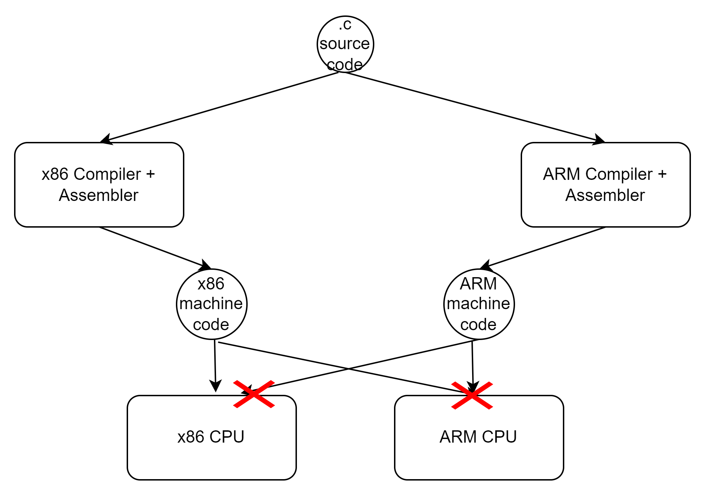
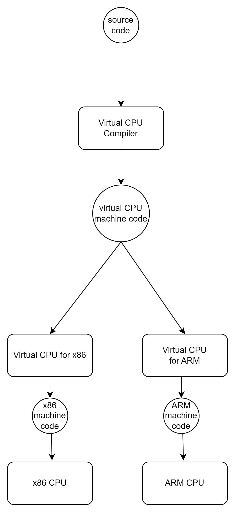
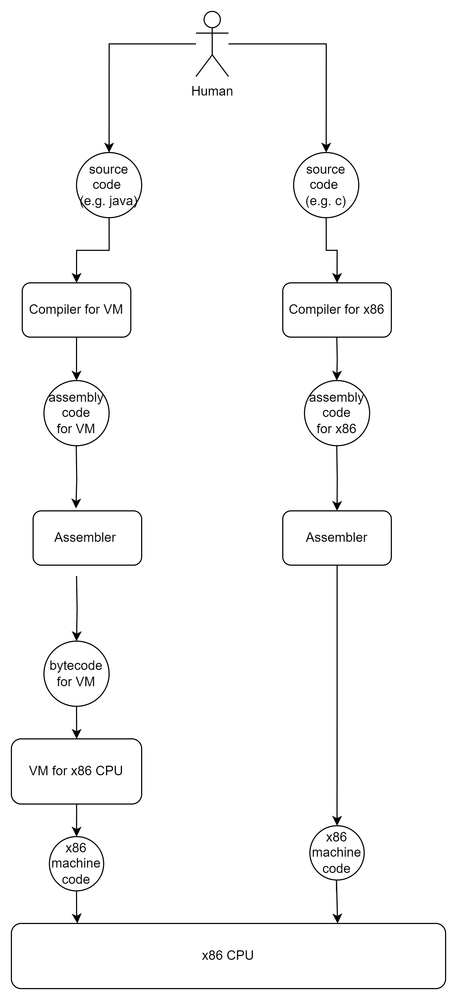
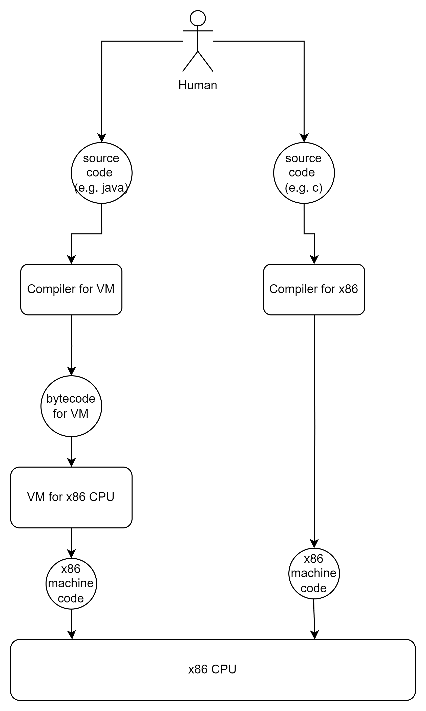

<h2>Brief introduction on how programs are executed</h2>
I'll be using the following definitions:  

_**Concrete**_ = more details  
_**Abstract**_ = less details  

_**Concrete**_ or _**Abstract**_ are relative definitions depending on the level.
C is **_concrete_** relative to python but _**abstract**_ relative to the machine code.

**_Machine_** = **_CPU_** 
**_Machine code_** = **_code for CPU_**

---

Running a program (in increasing level of abstraction) :

<h2> 1. CPU </h2>
Everything is done by CPU. To execute anything, you need a CPU. CPU is the lowest level of abstraction.  

|            |                                      |                           |
|------------|--------------------------------------|---------------------------|
| CPU Input  | Instruction in binary (machine code) | (e.g. `0x40`)             |
| CPU Output | Executing the instruction            | (e.g. `'Increment by 1'`) |

We kinda just agreed upon, that 0x40 corresponds to "Increment by 1" instruction for some particular CPU.
The instructions vary from CPU to CPU. Some instructions run on one CPU will not run on the other CPU (E.g. x86-CPUs(Intel/AMD) code will not run on ARM-CPUs)  
- We understand human description: `'Increment by 1'`  
- CPU understands only binary (machine code): `0x40`  

`'HUMAN' > machine code > 'CPU' > execution`

<h2> 1. Assembler/Disassembler </h2>

**_Assembly code_** = **_Machine code_** in a human-readable form.  
The abstraction level is **_the same_** as CPU, because it's 1-to-1 mapping between assembly instruction and binary instruction. It's as concrete as machine code, except it's readable  

|              | Input         | Output        | Example          |
|--------------|---------------|---------------|------------------|
| Assembler    | Assembly code | Machine Code  | `INC` -> `0x40`  |
| Disassembler | Machine code  | Assembly Code | `0x40` ->  `INC` |

 

`'HUMAN' > assembly code > 'ASSEMBLER' > machine code > 'CPU' > execution`    
`machine code > 'DISASSEMBLER' > assembly code  > 'HUMAN'`  

<h2> 3. Compiler </h2>
Compiler - is an abstraction above assembly code. Compiler compiles source code of a language to assembly code

E.g. (C lang)

|            | Input         | Output        | Example         |
|------------|---------------|---------------|-----------------|
| Compiler   | source code   | assembly code | `i++`  -> `INC` |
| Decompiler | assembly code | source code   | `INC`  -> `i++` |

  Some compilers contain often assembler within, and from the outside it would appear that the compiler compiles source code directly to machine code.

`'HUMAN' > source code > 'COMPILER' > assembly code > 'ASSEMBLER' > machine code > CPU > execution`

`machine code > 'DISASSEMBLER' > assembly code > 'DECOMPILER' > source code  > 'HUMAN'`
 
---

Problem:
- You have x86 CPU  
- Your friend has ARM CPU  
- You write a program in C and compile it for your CPU. (Compilers can compile code for different CPUs(x86, ARM etc))
- It produces assembly (= machine code) specific for x86 CPU.
- You want the friend to be able to run the same program on his ARM CPU
- Since the your machine code is only for x86, it cannot run on ARM CPU

Solutions:
1. Compile the source code for each CPU separately

2. Create a program, that acts as a different CPU ("fake"/**_"virtual" CPU_**)
  1. It takes some binary machine code (like a normal CPU) and executes it.
  2. The binary machine code (=instructions) for **_virtual CPU_** is the same for everyone.
    1. -> So everyone has the same "virtual" CPU and same instructions
    2. -> (unlike "real" CPUs, whose instructions can be different for different CPU (ARM, x86 etc.))
  3. It takes the given binary machine code (which is the same for everyone) and converts it to the binary machine code for a target CPU(which is different for someone)
  4. So instead of creating compiling a source code to a machine code for each CPU we:
    1. Create different virtual CPUs (different programs) for different real CPUs
    2. Different virtual CPUs accept however the same machine code
    3. We compile our source code to the machine code for virtual CPU.
    4. Virtual CPU accept the same machine code and translate it to the machine code of the real CPU, on which they are running.

<h2> 4. Virtual Machines </h2>

Virtual Machine is a program, that executes
machine code not designed for the target CPU  
**_Virtual Machine (VM)_** = **_virtual CPU_**  

Virtual machine is a fake CPU on top of the target CPU. Takes its own custom machine code and translates it to the target CPU machine code and runs it.  
VMs does not directly produce visible machine code for the CPU, that can be run later. They translate it internally and run it immediately after translation   
!! They do not produce a machine code that can be run later, they are not a compilers. They are simulating the underlying CPU. They take a command -> they translate it in target machine code and run it)

Definitions for disambiguation, that I'll use:  
**_Normal CPU_** accepts **_machine code_**  
_**Virtual Machine(CPU)**_ accepts **_bytecode_** (=just different name for machine code for VMs)  

|                        |                                                                                                                  |                                    |
|------------------------|------------------------------------------------------------------------------------------------------------------|------------------------------------|
| Virtual Machine Input  | **_Bytecode_** (VM's machine code)                                                                               | e.g. `0x10`                        |
| Virtual Machine Output | **_Machine code_** for the target CPU   **AND**   _**Execution**_ of this produced code on the target CPU. | e.g. `0x40` AND `'Increment by 1'` |

`'HUMAN' > bytecode > 'VM' > machine code > 'CPU' > execution`

<h2> 5. Assemblers\Compilers (for VM) </h2>
There is no such definition as Compilers for VM, but it's useful to differentiate between Compilers\Assemblers for real CPUs and for VMs.  

For all compilers **_always_** applies: they **produce machine code from the source code** for:
1. Real CPU (machine code and compilers described earlier)
2. VM (bytecode and compilers described later)

They act the same, but instead of compilation for real CPU its compiled to VM
The table is the same as with the other compilers and assemblers:

|                     | Input                                   | Output                                  | Example          |
|---------------------|-----------------------------------------|-----------------------------------------|------------------|
| Assembler for VM    | Human readable bytecode (assembly code) | Bytecode for VM                         | `iinc` -> `0x10` |                                                          |
| Disassembler for VM | Bytecode for VM                         | Human readable bytecode (assembly code) | `0x10` -> `iinc` |
| Compiler for VM     | Source code                             | Human readable bytecode (assembly code) | `i++` ->  `iinc` |                                                           |
| Decompiler for VM   | Human readable bytecode (assembly code) | Source code                             | `iinc` -> `i++`  |

`'HUMAN' > source code > 'COMPILER' > assembly code >  'ASSEMBLER' > bytecode  > 'VM' > machine code > 'CPU' > execution `

`bytecode > 'DISASSEMBLER' > assembly code > 'DECOMPILER' > java source code > 'HUMAN' `

<h2> Big Picture </h2>
Here for example is two possible compilation paths from source code to execution for x86 CPU

Assembly usually considered as intermediate step, which is done within compilers (both for real CPU and VMs)
So it's mostly produces the executable code/byte code directly from source code.

<h2> JVM </h2>
We will be dealing here with a particular VM, namely Java Virtual Machine  
JVM receives a bytecode (`.class` file) which is compiled by Java Compiler directly from source code (`.java` file). 
Java Compiler skips the assembly code and generates bytecode directly from source code.
However its possible to view the assembly code by disassembling the `.class` file

|                   | CMD/Program                                                                       | Input                      | Output                                                |                    |
|-------------------|-----------------------------------------------------------------------------------|----------------------------|-------------------------------------------------------|--------------------|
| Java VM           | `java`  (Comes with JDK)                                                          | Bytecode (`.class`)        | **_CPU Machine code_**    AND   _**Execution**_ | `0x1`  -> `0x40`   |
| Java Compiler     | `javac` (Comes with JDK)                                                          | Source code (`.java`)      | Bytecode (`.class`)                                   | `0x40` -> `0x1`    |
|                   |                                                                                   |                            |                                                       |                    |
| Java Disassembler | `javap` (Comes with JDK)                                                          | Bytecode (`.class  `)      | ~ Human readable bytecode                             | `0x40`  ->  `iinc` |
| Java Decompiler   | 1. FernFlower Decompiler (Comes with IDEA)   2.JD-GUI Decompiler 3. others...) | Bytecode (`.class  `)      | Source code `.java`                                   | `0x40` -> `i++`    |
|                   |                                                                                   |                            |                                                       |                    |
| Java Assembler    | (not usually used)                                                                | Human readable bytecode??? | Bytecode (`.class` )                                  | `0x1`              |

<h2> Sum Up: </h2>

Forward Engineering:

|                         | Input                   | Output                                    |
|-------------------------|-------------------------|-------------------------------------------|
| CPU                     | Machine code            | Execution of instructions                 |
| Assembler               | Assembly code           | Machine code                              |
| Compiler                | Source code             | Assembly code                             |
|                         |                         |                                           |
| VM                      | Bytecode                | CPU Machine code    AND   Execution |
| Assembler (VM)          | Human readable bytecode | Bytecode                                  |                                                          |
| Compiler (VM)           | Source code             | Human readable bytecode                   |                                                           |
|                         |                         |                                           |
| Java VM (`java`)        | Bytecode `.class`       | Machine code     AND   Execution    |
| Java Compiler (`javac`) | Source code `.java`     | Bytecode `.class`                         |

Reverse Engineering

|                                       | Input                                              | Output                  |
|---------------------------------------|----------------------------------------------------|-------------------------|
| Disassembler                          | Machine code                                       | Assembly code           |
| Decompiler                            | Machine code  / Assembly code                      | Source code             |
|                                       |                                                    |                         |
| Disassembler (VM)                     | Bytecode                                           | Human readable bytecode |
| Decompiler (VM)                       | Bytecode  / Human readable bytecode                | Source code             |
|                                       |                                                    |                         |
| Java Disassembler (`javap`)           | JVM Bytecode `.class  `                            | Human readable bytecode |
| Java Decompiler   (FernFlower, etc..) | JVM Bytecode `.class  `  / Human readable bytecode | Source code `.java`     |

  Don't forget: ASSEMBLY = MACHINE CODE. It's a 1-to-1 mapping.  
  Don't forget: Human READABLE bytecode = BYTECODE. It's a 1-to-1 mapping.

